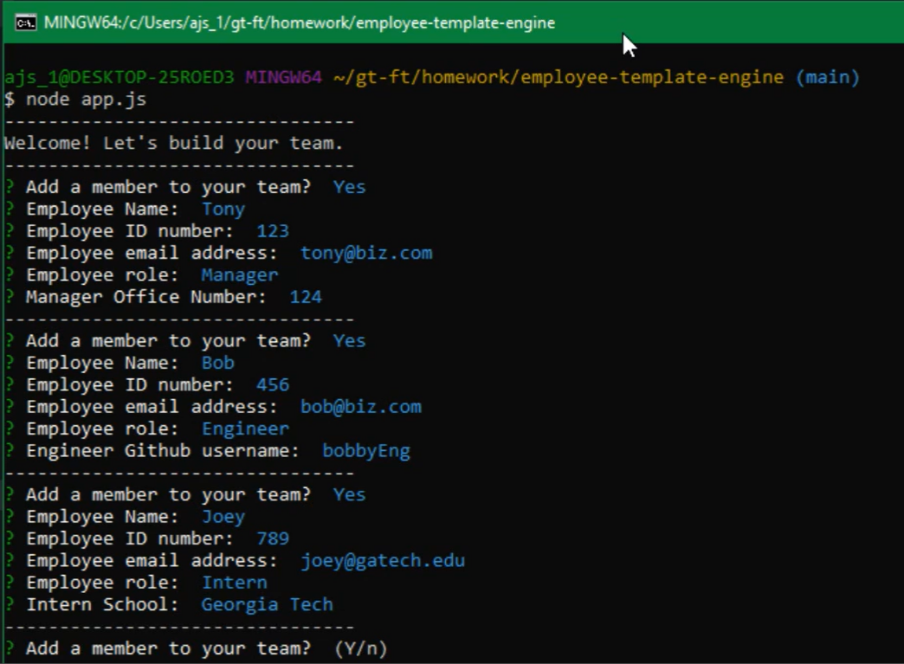
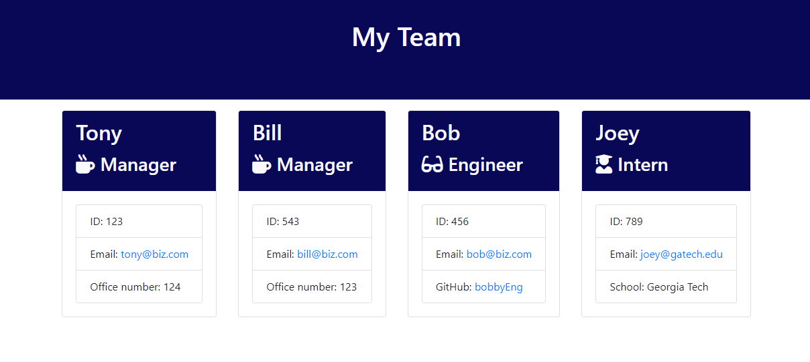

# Employee Template Engine
  

  ## Description
  
  Project to create an oranization chart for a team of employees.
  
  ---
  
  ## Table of Contents
  
  - [Installation](#installation)
  - [Usage](#usage)
  - [Credits](#credits)
  - [Contributing](#contributing)
  - [Tests](#tests)
  - [Questions](#questions)
  - [License](#license)
  
  ---
  
  ## Installation

  1. Fork the repo from the GitHub link listed below. 
  2. You may need to install [Node.js](https://nodejs.org/en/) if you have not already. 
  3. Open your terminal and navigate to the correct file path of the readme generator directory.
  4. Run `npm install` in the terminal.
  
  
  Demo video: [https://drive.google.com/file/d/1X7NkbsWsuxDpGRQPwayQFA3yLWRjdq50/view?usp=sharing](https://drive.google.com/file/d/1X7NkbsWsuxDpGRQPwayQFA3yLWRjdq50/view?usp=sharing)
  
  URL for repository: [https://github.com/tonyschwebach/employee-template-engine](https://github.com/tonyschwebach/employee-template-engine)
  
  ---
  
  ## Usage
  
  1. Run `node app.js` in the terminal.
  2. Answer the prompt questions. Your answers will be used to generate the html file.
  3. A file named `team.html` will be created for you in the `output` folder which you can open in your browser.

  Demo

  
  
  Command Line

  
  
  Output

  
  
  ---
  
  ## Credits
  
  Georgia Tech instructional staff and Full-Time Full-Stack cohort. 
  
  Special thanks to John Erler for his help on regex validations.
  
  
  ---
  
  ## Contributing

  Not currently accepting contributions.
  
  ---
  
  ## Tests

  N/A
  
  ---
  
  ## Questions
  
  Please contact [tony.schwebach.developer@gmail.com](mailto:tony.schwebach.developer@gmail.com) or tonyschwebach on [Github](https://github.com/tonyschwebach/).
   
  ---
  
## License

MIT License

Copyright (c) [2021] [tonyschwebach]
    
Permission is hereby granted, free of charge, to any person obtaining a copy
of this software and associated documentation files (the "Software"), to deal
in the Software without restriction, including without limitation the rights
to use, copy, modify, merge, publish, distribute, sublicense, and/or sell
copies of the Software, and to permit persons to whom the Software is
furnished to do so, subject to the following conditions:

The above copyright notice and this permission notice shall be included in all
copies or substantial portions of the Software.

THE SOFTWARE IS PROVIDED "AS IS", WITHOUT WARRANTY OF ANY KIND, EXPRESS OR
IMPLIED, INCLUDING BUT NOT LIMITED TO THE WARRANTIES OF MERCHANTABILITY,
FITNESS FOR A PARTICULAR PURPOSE AND NONINFRINGEMENT. IN NO EVENT SHALL THE
AUTHORS OR COPYRIGHT HOLDERS BE LIABLE FOR ANY CLAIM, DAMAGES OR OTHER
LIABILITY, WHETHER IN AN ACTION OF CONTRACT, TORT OR OTHERWISE, ARISING FROM,
OUT OF OR IN CONNECTION WITH THE SOFTWARE OR THE USE OR OTHER DEALINGS IN THE
SOFTWARE.
  
